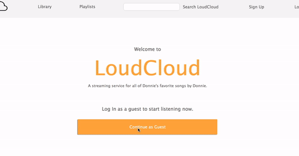
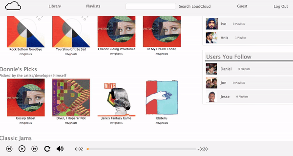
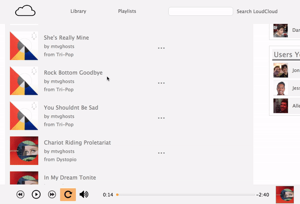

# LoudCloud
## React - Redux - JavaScript - Ruby - Rails - AWS


Welcome to `LoudCloud`, my take on the popular music sharing website **SoundCloud**.

https://the-loudcloud.herokuapp.com/

This is my first full-stack application, utilizing a `Rails` backend and a `React` frontend 

The PostgreSQL database was seeded with music made **entirely by me!**

## User Login and Signup
----------
 - Full Frontend and Backend User Authentication
 - Modals for both Login and Signup
 - "Guest Login" with an animated effect
--------------


-------------
## Music Streaming while Navigating Site
---------
- Song information and album artwork dynamically updated on the Playbar
- Click any album cover to play
---------------

-----------------
## Playlist Creation
--------
- Create, edit, and rock out to your own playlists
- Hear other user's playlists
-------------------

-------------------
## Music Player
-----------
- I designed a custom audio player with volume, progress and loop controls using the html `<audio>` tag and the Redux cycle.
  

``` javascript
     handlePlay() {
        let player = document.getElementById("audio-player")
        player.setAttribute('src', this.props.song.song_url)

        if (this.props.paused === true) {
            this.props.play(this.props.song)
            player.play();
        } else if (this.props.paused === false && this.props.song.id !== this.props.currentSong.id) { 
            this.props.play(this.props.song)
            player.play();
        } else {
            this.props.pause();
            player.pause()
           
        }
    }
```
## Feel free to check out the site and **enjoy my tunes!** :)